# dev-local-artifact-pruner

O **dev-local-artifact-pruner** é uma ferramenta desktop local-first desenvolvida em Python e PySide6 para auditar projetos locais de desenvolvimento, diagnosticar a inatividade através do histórico do Git e podar com segurança artefatos pesados e regeneráveis (`node_modules`, `venv`, `.venv`, caches de testes e builds), liberando espaço em disco sem jamais colocar em risco o código-fonte.

<p align="center">
  
</p>

---

## Objetivo

Auditar diretórios de desenvolvimento locais, apresentar diagnósticos claros de inatividade através do histórico do Git e permitir a poda seletiva e reversível de dependências pesadas, sem colocar em risco branches, código-fonte, bancos de dados ou documentações.

---

## Premissas Técnicas e Segurança

- **Execução 100% Local**: Sem telemetria, envio de dados, backend web ou sincronização remota.
- **Segurança Estrita de Dados**: Arquivos de documentação (`.md`, `.txt`, `.html`), variáveis de ambiente (`.env*`) e bancos de dados (`*.sqlite`, `*.db`) são estritamente protegidos e nunca removidos.
- **Resiliência no Windows**: Bypass automático de atributos de somente leitura (`FILE_ATTRIBUTE_READONLY`) comuns em árvores profundas de dependências (`node_modules`).
- **Reversibilidade Automatizada**: Gravação do script `rebuild_dependencies.py` na raiz de cada projeto limpo contendo os comandos reais para restauração do ambiente.
- **Varredura Assíncrona Desacoplada**: Processamento em segundo plano via `QThread`, garantindo interface fluida sem congelamentos mesmo em diretórios com centenas de repositórios.

---

## Recursos Principais

- **Interface Desktop Nativa**: Desenvolvida em PySide6 (Qt) com design dark mode moderno, ícones vetoriais dinâmicos e tipografia limpa.
- **Dois Modos de Auditoria**:
  - **Projeto Individual**: Análise pontual com diagnóstico completo de uma pasta específica.
  - **Múltiplos Projetos**: Varredura recursiva de diretórios com controle de profundidade e listagem consolidada.
- **Diagnóstico Git Inteligente**:
  - Cálculo de dias de inatividade desde o último commit.
  - Verificação de estado pendente (*dirty* / alterações não commitadas).
  - Sugestões automáticas contextuais: **Manter** (projeto ativo) vs. **Limpar** (projeto inativo).
- **Detecção Multiecossistema**: Identificação de projetos Node.js (`package.json`), Python (`pyproject.toml`, `requirements.txt`, `setup.py`), entre outros.
- **Filtros Ágeis**: Botões de um clique para `[ Marcar Inativos ]` e `[ Desmarcar Todos ]`.
- **Terminal Interativo Integrado**: Painel de logs em tempo real com detalhamento do repositório, artefatos elegíveis e espaço recuperável.
- **Confirmação em Duas Etapas**: Exibição da lista exata de pastas a serem podadas e o volume total de bytes a serem liberados antes de qualquer exclusão física.
- **Garantia de Restauração**: Criação automática de scripts de reconstrução (`rebuild_dependencies.py`) com comandos como `npm install` ou `pip install`.
- **Alta Cobertura de Testes**: Suíte robusta com 414 testes automatizados em `pytest`.

---

## Fluxo de Processamento (Pipeline)

```text
[Diretório Alvo] 
        ↓
 [Scanner Recursivo] ────────→ Detecta projetos e ecossistemas (Node, Python, etc.)
        ↓
  [Git Inspector] ──────────→ Analisa último commit, inatividade e alterações pendentes
        ↓
 [Artifact Auditor] ────────→ Mapeia dependências regeneráveis (node_modules, venvs, caches)
        ↓
[Diagnóstico & Regras] ─────→ Sugere "Manter" (ativo) ou "Limpar" (inativo)
        ↓
   ┌────┴──────────────────────────┐
   ↓                               ↓
[Manter]                       [Poda Segura]
Projeto preservado             1. Gera script rebuild_dependencies.py
                               2. Bypass de permissões readonly (Windows)
                               3. Exclusão segura de artefatos elegíveis
                               4. Código-fonte e histórico Git 100% intactos
```

---

## Stack Tecnológica

- **Python 3.11+**
- **PySide6** (Qt for Python) para a interface gráfica desktop
- **Subprocess & Pathlib** para integração Git nativa e navegação no sistema de arquivos
- **APIs nativas de sistema (os, stat, shutil)** com suporte a caminhos estendidos do Windows (`\\?\` para bypass de `MAX_PATH`) e remoção resiliente de permissões somente leitura
- **pytest** para a suíte de testes unitários e de integração

---

## Instalação e Execução

### 1. Clonar o Repositório e Criar o Ambiente Virtual

```bash
git clone https://github.com/pedrolabre/dev-local-artifact-pruner.git
cd dev-local-artifact-pruner

python -m venv .venv

# Windows (PowerShell)
.venv\Scripts\Activate.ps1

# Windows (CMD)
.venv\Scripts\activate.bat

# Linux / macOS
source .venv/bin/activate
```

### 2. Instalar as Dependências

```bash
# Instalação em modo editável com dependências de desenvolvimento
pip install -e ".[dev]"
```

### 3. Executar o Aplicativo

Você pode iniciar o aplicativo diretamente de duas maneiras:

```bash
# Opção 1: Via script de execução direta (Recomendado)
python run_desktop.py

# Opção 2: Pelo comando CLI registrado
dev-pruner
```

---

## Uso da Interface Gráfica

A interface foi projetada para ser direta, visual e segura:

1. **Escolha do Modo**: Na tela inicial, selecione entre auditar um **Projeto** individual ou **Múltiplos** projetos em lote.
2. **Definição da Pasta**: Informe ou selecione a pasta raiz desejada pelo botão **Procurar...**.
3. **Varredura Assíncrona**: Clique em **[Analisar]**. O terminal exibirá o escaneamento em tempo real sem travar a interface.
4. **Inspeção dos Resultados**:
   - A coluna da esquerda lista todos os projetos encontrados com seus respectivos tamanhos e status (**[Ativo]** ou **[Inativo]**).
   - Ao clicar em qualquer projeto, o terminal detalha o caminho, ecossistema, último commit e espaço recuperável.
5. **Seleção e Preparação**:
   - Utilize o botão **[Marcar Inativos]** para selecionar rapidamente apenas os projetos elegíveis com segurança.
   - Clique em **[Apagar]** para preparar a confirmação.
6. **Execução Segura**:
   - O botão **[Confirmar]** será habilitado com o resumo do espaço total a ser liberado.
   - Clique em **[Confirmar]** para executar a poda e gerar o script `rebuild_dependencies.py`.
7. **Retorno ao Início**: Clique em **[ ← Voltar ao Início ]** para realizar novas auditorias.

---

## Estrutura do Projeto

```text
.
├── .github/
│   └── assets/
│       └── gui-layout.svg        # Demonstração vetorial animada da interface
├── pyproject.toml                # Metadados e dependências do pacote
├── README.md                     # Documentação principal
├── run_desktop.py                # Script de inicialização desktop
├── src/
│   └── dev_local_artifact_pruner/
│       ├── __init__.py
│       ├── main.py               # Ponto de entrada da aplicação
│       ├── core/                 # Núcleo de regras e lógica de negócio
│       │   ├── git_client.py     # Integração e diagnósticos Git
│       │   ├── models.py         # Modelos de domínio e dataclasses
│       │   ├── pruner.py         # Orquestrador de poda segura
│       │   ├── rebuilder.py      # Gerador de rebuild_dependencies.py
│       │   ├── rules.py          # Regras de elegibilidade de artefatos
│       │   └── scanner.py        # Varredura recursiva de repositórios
│       ├── ui/                   # Interface gráfica PySide6 (Qt)
│       │   ├── assets/           # Ícones SVG da interface
│       │   ├── home_screen.py    # Tela de seleção de modo
│       │   ├── icons.py          # Renderizador de ícones vetoriais
│       │   ├── main_window.py    # Janela principal e navegação
│       │   ├── multi_screen.py   # Tela de múltiplos projetos
│       │   ├── project_list.py   # Widget de listagem e seleção
│       │   ├── single_screen.py  # Tela de projeto individual
│       │   ├── styles.py         # Folhas de estilo QSS e cores
│       │   └── terminal.py       # Widget de terminal e logs
│       └── utils/                # Utilitários de sistema
│           ├── disk_usage.py     # Cálculo de ocupação em disco
│           ├── formatters.py     # Formatação de bytes e tempos
│           └── safe_delete.py    # Exclusão resiliente com bypass de readonly
└── tests/                        # Suíte de testes automatizados (414 testes)
```

---

## Testes Automatizados

O projeto conta com testes unitários e de integração cobrindo manipulação de arquivos, detecção de repositórios Git, tratamento de permissões e componentes da interface gráfica:

```bash
# Executar a suíte completa de testes
python -m pytest

# Executar com relatório detalhado
python -m pytest -v
```
